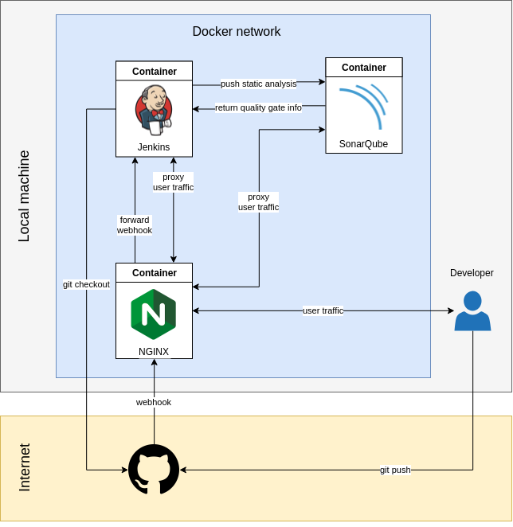

# Docker CI - Continuous integration with docker containers

## Basic architecture


## Launching the CI environments

To launch the CI environment, first make sure to take down the container if it already exists:

```bash
docker-compose --file docker-compose.yml down
```

Then run:

```bash
docker-compose --file docker-compose.yml up
```

## Jenkins

To see the Jenkins logs:

```bash
docker logs $(sudo docker ps | grep "docker-ci-jenkins" | cut -d " " -f 1) --tail 200 -f
```

To run bash commands in the Jenkins container:

```bash
docker exec -i -t $(sudo docker ps | grep "docker-ci-jenkins" | cut -d " " -f 1) /bin/bash
```

If many of the recommended plugins fail to load during the first install, it may just be because of a slow or unavailble download mirror. Try again after some time.


## SonarQube

To run bash commands in the SonarQube container:

```bash
docker exec -i -t $(sudo docker ps | grep "docker-ci-sonarqube" | cut -d " " -f 1) /bin/bash
```
